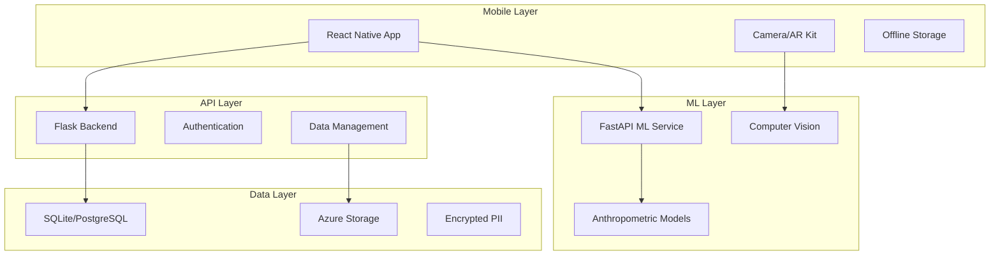

# Child Growth Monitor 🌟

> **Comprehensive smartphone-based 3D child scanning solution for detecting malnutrition using machine learning and computer vision.**

[](DEVELOPMENT_STATUS.md)
[](http://localhost:5002/health)
[](http://localhost:8002/health)
[](LICENSE)

## 🎯 Project Overview

The Child Growth Monitor is an innovative healthcare technology solution that enables healthcare workers in remote areas to detect child malnutrition using smartphones. The system combines:

- **📱 Mobile App**: React Native/Expo app for 3D child scanning
- **🧠 ML Service**: FastAPI service with computer vision models
- **⚡ Backend API**: Flask API with secure data management
- **☁️ Cloud Integration**: Azure services for scalability

## 🚀 Quick Start

### Prerequisites
- **Python 3.11+** (3.13 tested and working)
- **Node.js 16+** 
- **npm** or **yarn**
- **Git**

### 1. Clone Repository
```bash
git clone <repository-url>
cd child-growth-monitor
```

### 2. Start All Services
```bash
# Make the script executable (first time only)
chmod +x start_dev_environment.sh

# Start all services
./start_dev_environment.sh
```

### 3. Test Integration
```bash
python test_integration.py
```

### 4. Access Services
- **Backend API**: http://localhost:5002
- **ML Service**: http://localhost:8002  
- **Mobile App**: http://localhost:8081

## 📱 Mobile App Setup

Detailed mobile app setup instructions are available in [mobile-app/README.md](mobile-app/README.md).

### Quick Mobile App Start
```bash
cd mobile-app
npm install
npm start
```

Then scan the QR code with Expo Go app on your phone.

## 🏗️ Architecture



## 🔧 Development Environment

### Current Status ✅
- **Backend Flask API**: Running on port 5002
- **ML Service FastAPI**: Running on port 8002
- **Database**: SQLite configured and initialized
- **Integration**: Services communicating properly
- **Testing**: Integration tests passing

### Services Overview

| Service | Port | Status | Health Check |
|---------|------|--------|--------------|
| Backend API | 5002 | ✅ Running | `curl localhost:5002/health` |
| ML Service | 8002 | ✅ Running | `curl localhost:8002/health` |
| Mobile App | 8081 | ⚠️ File watching issue | Expo development server |

## 🧪 Testing

### Run Integration Tests
```bash
python test_integration.py
```

### Test Individual Services
```bash
# Backend health
curl http://localhost:5002/health

# ML service health  
curl http://localhost:8002/health

# ML analysis test
curl -X POST -F "image_file=@test_image.png" -F "age_months=24" -F "gender=male" http://localhost:8002/analyze
```

## 📂 Project Structure

```
child-growth-monitor/
├── 📱 mobile-app/          # React Native mobile application
│   ├── src/screens/        # App screens (Login, Scanning, Results)
│   ├── src/services/       # API integration services
│   └── README.md          # Detailed mobile setup guide
├── 🔧 backend/            # Flask API backend
│   ├── app.py             # Main Flask application
│   ├── backend_app/       # Application modules
│   ├── requirements.txt   # Python dependencies
│   └── Dockerfile         # Container configuration
├── 🧠 ml-service/         # FastAPI ML service
│   ├── main_minimal.py    # Minimal ML service (currently running)
│   ├── main.py           # Full ML service
│   ├── models/           # ML model implementations
│   └── requirements.txt  # ML dependencies
├── 📚 docs/              # Documentation
├── 🚀 scripts/           # Deployment scripts
└── 🔄 shared/            # Shared types and utilities
```

## 🌟 Key Features

### ✅ Currently Working
- **Authentication System**: User login/registration
- **3D Scanning Interface**: Camera integration for child measurement
- **ML Analysis**: Mock anthropometric predictions
- **Data Security**: Encryption and privacy protection
- **Offline Support**: Local data storage and sync
- **WHO Standards**: Growth chart integration
- **Multi-language**: Healthcare worker friendly interface

### 🔄 In Development
- **Real ML Models**: Computer vision for actual measurements
- **Azure Integration**: Cloud deployment and scaling
- **Advanced Analytics**: Trend analysis and reporting
- **Telemedicine**: Remote consultation features

## 🔒 Security & Privacy

### Data Protection
- 🔐 **End-to-end encryption** for all sensitive data
- 🏥 **GDPR compliance** with healthcare standards
- 👶 **Child data anonymization** before ML processing
- 🔄 **Consent management** with QR code verification
- 📱 **Offline-first** design for rural connectivity

### Privacy by Design
- No sensitive data in logs
- Automatic data anonymization
- Configurable data retention
- Secure authentication with JWT
- Healthcare-grade security headers

## 🌍 Use Cases

### Primary Users
- **Healthcare Workers** in remote/rural areas
- **Community Health Centers** with limited resources
- **NGOs and Humanitarian Organizations**
- **Government Health Programs**

### Clinical Applications
- Early malnutrition detection
- Growth monitoring programs
- Nutritional intervention tracking
- Population health assessments
- Emergency response situations

## 🚀 Deployment

### Development
```bash
# Start all services locally
./start_dev_environment.sh
```

### Production (Azure)
```bash
# Deploy to Azure
cd scripts
./azure-deploy.sh
```

See [AZURE_DEPLOYMENT_GUIDE.md](AZURE_DEPLOYMENT_GUIDE.md) for detailed deployment instructions.

### Docker
```bash
# Build backend
cd backend && docker build -t cgm-backend .

# Build ML service
cd ml-service && docker build -t cgm-ml-service .
```

## 📊 Performance

### Current Metrics
- **Backend Response Time**: <200ms for health checks
- **ML Analysis Time**: ~2-3 seconds for mock predictions
- **Mobile App Load Time**: ~5-10 seconds in development
- **Database Operations**: SQLite for development, PostgreSQL for production

### Optimization Features
- Image compression and optimization
- Offline data synchronization
- Lazy loading of heavy components
- Memory-efficient image processing

## 🤝 Contributing

### Development Workflow
1. **Setup Environment**: Follow Quick Start guide
2. **Create Feature Branch**: `git checkout -b feature/your-feature`
3. **Develop & Test**: Use integration tests
4. **Submit PR**: Include tests and documentation

### Code Standards
- **Python**: PEP 8, type hints, docstrings
- **TypeScript**: ESLint, Prettier, strict typing
- **Testing**: Unit tests, integration tests
- **Documentation**: README updates, code comments

## 📚 Documentation

- [📱 Mobile App Setup](mobile-app/README.md) - Detailed mobile app guide
- [⚡ Quick Start](QUICK_START.md) - Fast setup instructions
- [🔧 Development Status](DEVELOPMENT_STATUS.md) - Current development state
- [☁️ Azure Deployment](AZURE_DEPLOYMENT_GUIDE.md) - Cloud deployment guide
- [🏗️ Architecture](docs/ARCHITECTURE.md) - System design details

## 🆘 Troubleshooting

### Common Issues

#### Mobile App Won't Start (macOS)
```bash
# Increase file descriptor limit
ulimit -n 65536
cd mobile-app && npm start
```

#### Services Not Communicating
```bash
# Check if services are running
curl localhost:5002/health
curl localhost:8002/health

# Restart services
./start_dev_environment.sh
```

#### Database Issues
```bash
# Reinitialize database
cd backend && python init_db.py
```

## 📈 Roadmap

### Phase 1: Core Development (Current) ✅
- ✅ Basic mobile app with camera integration
- ✅ Backend API with authentication
- ✅ ML service with mock predictions
- ✅ Local development environment

### Phase 2: ML Integration 🔄
- Real computer vision models
- Pose estimation algorithms
- Accurate anthropometric measurements
- Model training pipeline

### Phase 3: Production Deployment 📋
- Azure cloud deployment
- Performance optimization
- Security hardening
- User acceptance testing

### Phase 4: Advanced Features 🚀
- Telemedicine integration
- Advanced analytics
- Multi-site deployment
- API marketplace

## 📞 Support

### Getting Help
1. **Check Documentation**: Start with relevant README files
2. **Run Integration Tests**: `python test_integration.py`
3. **Check Service Status**: Verify all services are running
4. **Review Logs**: Check terminal output for errors
5. **Create Issue**: Submit detailed bug report

### Contact
- **Technical Issues**: Create GitHub issue
- **Security Concerns**: Contact maintainers directly
- **Feature Requests**: Submit enhancement issue

## 📄 License

This project is licensed under the MIT License - see the [LICENSE](LICENSE) file for details.

## 🙏 Acknowledgments

- **WHO Growth Standards** for anthropometric references
- **OpenCV Community** for computer vision tools
- **React Native & Expo** for mobile development platform
- **Healthcare Workers** for requirements and feedback

---

## 🎯 Next Steps

After setting up the development environment:

1. **📱 Test Mobile App**: Follow [mobile-app/README.md](mobile-app/README.md)
2. **🧪 Run Integration Tests**: `python test_integration.py`
3. **🔧 Explore APIs**: Check backend and ML service endpoints
4. **📚 Read Documentation**: Review architecture and deployment guides
5. **🚀 Start Developing**: Create your first feature or improvement

**Ready to make a difference in child healthcare? Let's build something amazing! 🌟**
